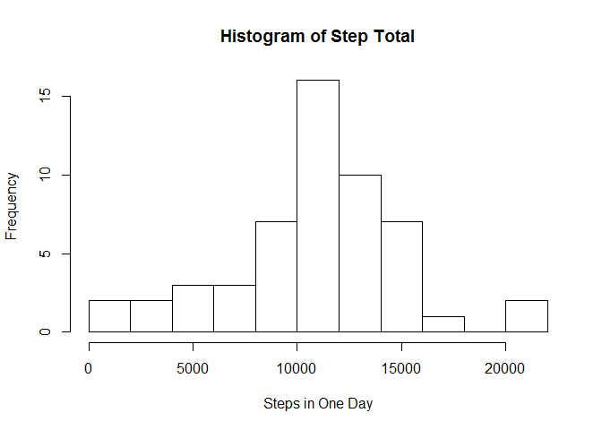
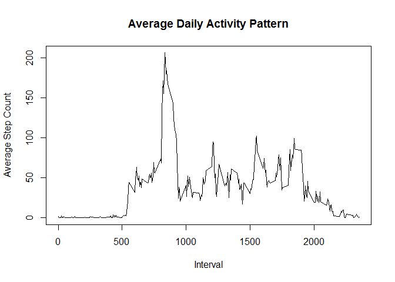
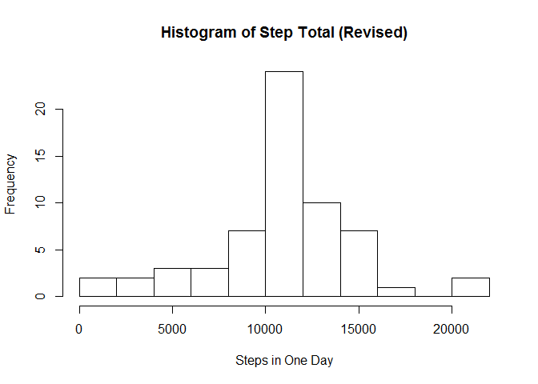
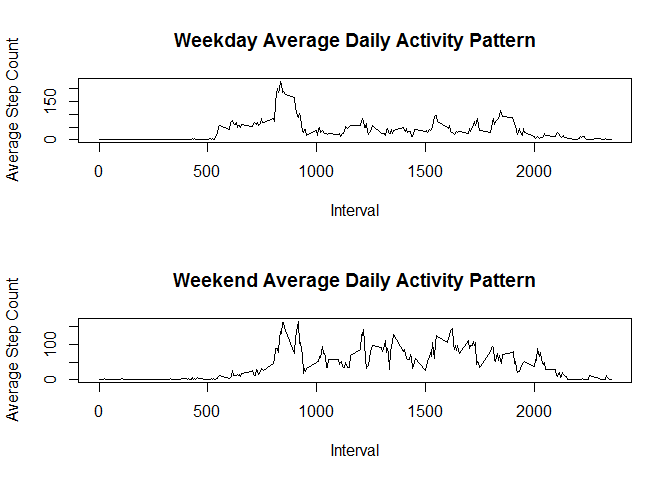

# Reproducible Research - Peer Assessment 1
Kevin Feng  
Sunday, September 20, 2015  

Load data and required packages for this exercise.


```r
setwd('C:/Users/Kevin/Documents/R')
data <- read.csv('activity.csv')
library(plyr)
library(lubridate)
library(lattice)
```

### Part 1: Steps Per Day

1. Using ddply, we can create a histogram demonstrating the distribution of step totals per day.


```r
dfx <- ddply(data, .(date), summarize, step_total = sum(steps))
hist(dfx$step_total, breaks = 8, main = "Histogram of Step Total", xlab = "Steps in One Day")
```

 

2. What is the mean total number of steps taken per day?

```r
mean(dfx$step_total, na.rm = TRUE)
```

```
## [1] 10766.19
```

3. What is the median number of steps taken per day?

```r
median(dfx$step_total, na.rm = TRUE)
```

```
## [1] 10765
```

### Part 2: Daily Activity Pattern

1. Using ddply to summarize the mean of the steps taken per interval, we can create a line graph demonstrating the average daily activity pattern of the experimental subject over the course of data collection.

```r
dfx2 <- ddply(data, .(interval), summarize, step_average = mean(steps, na.rm = TRUE))
plot(dfx2$interval, dfx2$step_average, type = 'l', main = "Average Daily Activity Pattern", xlab = "Interval", ylab = "Average Step Count")
```

 

1. Which 5-minute interval, on average, contains the most amount of steps?

```r
dfx2$interval[which.max(dfx2$step_average)]
```

```
## [1] 835
```

2. On average, how many steps were taken in that interval?

```r
dfx2$step_average[which.max(dfx2$step_average)]
```

```
## [1] 206.1698
```

### Part 3: Inputting Missing Values

1. How many missing values are in the dataset?

```r
sum(is.na(data$steps))
```

```
## [1] 2304
```

2. Missing values in the dataset are filled in using the mean for that 5-minute interval. This strategy for filling in missing data points allows us to reasonably estimate the activity that could have taken place during periods of missing data based on average performance across the full study. We can then avoid the "0" bias from ignoring these missing data points.

```r
data2 <- merge(data, dfx2, by = "interval")
data2 <- data2[order(data2$date, data2$interval),] 
data2 <- transform(data2, steps =ifelse(is.na(data2$steps),data2$step_average, data2$steps))
rownames(data2) <- NULL
```

3. Using this revised dataset, we can replot the histogram of daily step totals.

```r
dfx3 <-  ddply(data2, .(date), summarize, step_total = sum(steps))
hist(dfx3$step_total, breaks = 8, main = "Histogram of Step Total (Revised)", xlab = "Steps in One Day")
```

 

4. What is the mean number of steps taken per day (revised)?

```r
mean(dfx3$step_total)
```

```
## [1] 10766.19
```

5. What is the median number of steps taken per day (revised)?

```r
median(dfx3$step_total)
```

```
## [1] 10766.19
```

Due to the approach that we took in replacing missing values with the average step count for that interval, the mean and the median are now the same. Several days in which step data was not recorded were fully substituted by the mean total value, which resulted in the median also falling on the mean value.

### Part 4: Activity Patterns between Weekdays and Weekends

1. Using the lubridate package, we can add an additional factor to our dataset that differentiates weekdays versus weekends.

```r
data3 <- data2
data3$weekday <- ifelse(wday(data3$date) %in% 2:6, "weekday", "weekend")
```

2. We can then make a panel plot depicting the differences in activity during weekdays and weekends.

```r
weekdayActivity <- ddply(data3[data3$weekday == "weekday",], .(interval), summarize, step_average = mean(steps))
weekendActivity <- ddply(data3[data3$weekday == "weekend",], .(interval), summarize, step_average = mean(steps))
par(mfrow=c(2,1)) 
plot(weekdayActivity$interval, weekdayActivity$step_average, type = 'l', main = "Weekday Average Daily Activity Pattern", xlab = "Interval", ylab = "Average Step Count")
plot(weekendActivity$interval, weekendActivity$step_average, type = 'l', main = "Weekend Average Daily Activity Pattern", xlab = "Interval", ylab = "Average Step Count")
```

 

Thanks for reviewing.

####END

